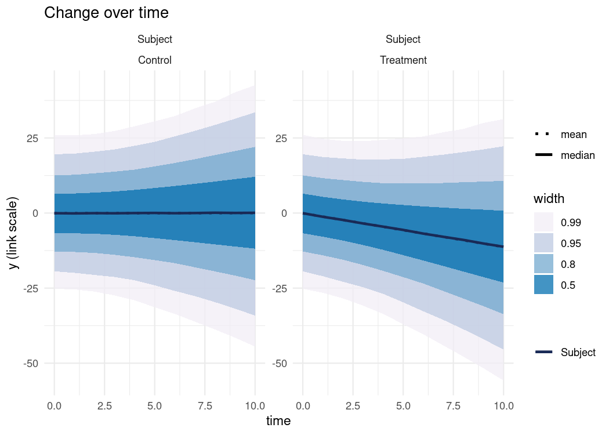
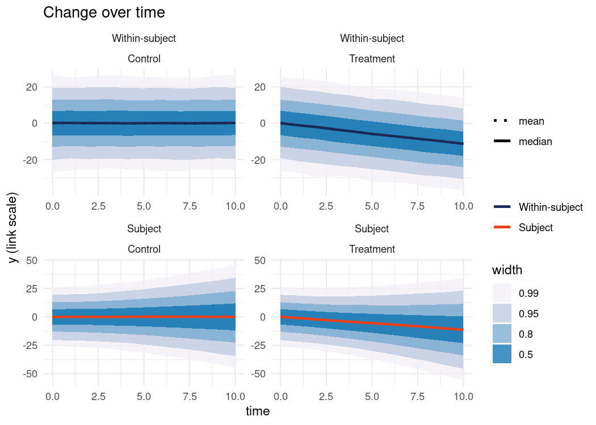
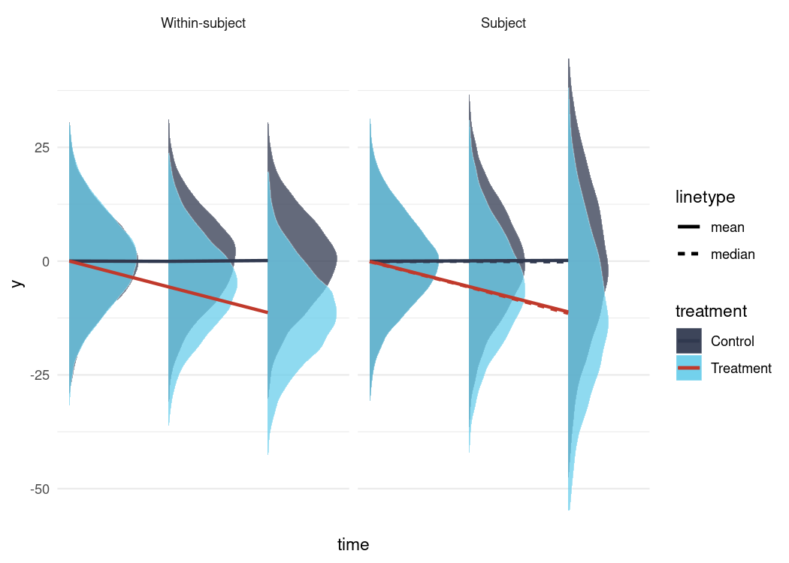
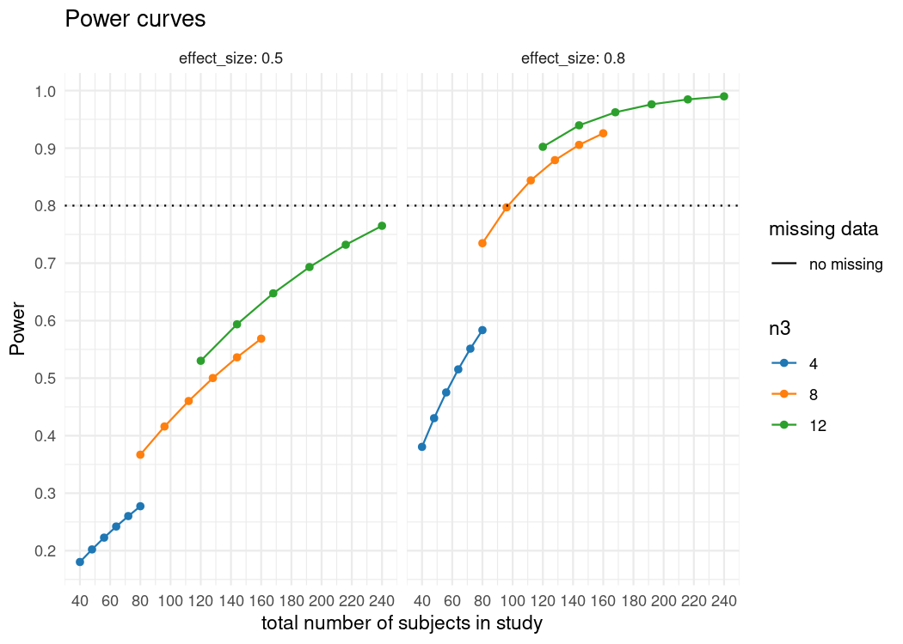

<!-- README.md is generated from README.Rmd. Please edit that file -->
powerlmm
========

[](https://travis-ci.org/rpsychologist/powerlmm) [](https://cran.r-project.org/package=powerlmm) [](https://cran.r-project.org/package=powerlmm)

Power Analysis for Longitudinal Multilevel/Linear Mixed-Effects Models.

Overview
--------

The purpose of `powerlmm` is to help design longitudinal treatment studies (parallel groups), with or without higher-level clustering (e.g. longitudinally clustered by therapists, groups, or physician), and missing data. The main features of the package are:

-   Longitudinal two- and three-level (nested) linear mixed-effects models, and partially nested designs.
-   Random slopes at the subject- and cluster-level.
-   Missing data.
-   Unbalanced designs (both unequal cluster sizes, and treatment groups).
-   Design effect, and estimated type I error when the third-level is ignored.
-   Fast analytical power calculations for all designs.
-   Power for small samples sizes using Satterthwaite's degrees of freedom approximation.
-   Explore bias, Type I errors, model misspecification, and LRT model selection using convenient simulation methods.

Installation
------------

`powerlmm` can be installed from CRAN and GitHub.

``` r
# CRAN, version 0.4.0
install.packages("powerlmm")

# GitHub, dev version
devtools::install_github("rpsychologist/powerlmm")
```

Example usage
-------------

This is an example of setting up a three-level longitudinal model with random slopes at both the subject- and cluster-level, with different missing data patterns per treatment arm. Relative standardized inputs are used, but unstandardized raw parameters values can also be used.

``` r
library(powerlmm)
d <- per_treatment(control = dropout_weibull(0.3, 2),
               treatment = dropout_weibull(0.2, 2))
p <- study_parameters(n1 = 11,
                      n2 = 10,
                      n3 = 5,
                      T_end = 10,
                      icc_pre_subject = 0.5,
                      icc_pre_cluster = 0,
                      icc_slope = 0.05,
                      var_ratio = 0.02,
                      dropout = d,
                      effect_size = cohend(-0.8, 
                                           standardizer = "pretest_SD"))

p
#> 
#>      Study setup (three-level, nested) 
#> 
#>               n1 = 11
#>               n2 = 10 x 5 (treatment)
#>                    10 x 5 (control)
#>               n3 = 5      (treatment)
#>                    5      (control)
#>                    10     (total)
#>          total_n = 50     (treatment)
#>                    50     (control)
#>                    100    (total)
#>          dropout =  0,  1,  2,  3,  4,  5,  6,  7,  8,  9, 10 (time)
#>                     0,  0,  1,  3,  6,  9, 12, 16, 20, 25, 30 (%, control)
#>                     0,  0,  1,  2,  4,  5,  8, 10, 13, 17, 20 (%, treatment)
#> icc_pre_subjects = 0.5
#> icc_pre_clusters = 0
#>        icc_slope = 0.05
#>        var_ratio = 0.02
#>      effect_size = -0.8 (Cohen's d [SD: pretest_SD])
```

``` r
plot(p)
```



``` r
get_power(p, df = "satterthwaite")
#> NULL
#> 
#>      Power Analysis for Longitudinal Linear Mixed-Effects Models (3-level,)
#>                   with missing data and unbalanced designs 
#> 
#>               n1 = 11
#>               n2 = 10 x 5 (treatment)
#>                    10 x 5 (control)
#>               n3 = 5      (treatment)
#>                    5      (control)
#>                    10     (total)
#>          total_n = 50     (control)
#>                    50     (treatment)
#>                    100    (total)
#>          dropout =  0,  1,  2,  3,  4,  5,  6,  7,  8,  9, 10 (time)
#>                     0,  0,  1,  3,  6,  9, 12, 16, 20, 25, 30 (%, control)
#>                     0,  0,  1,  2,  4,  5,  8, 10, 13, 17, 20 (%, treatment)
#> icc_pre_subjects = 0.5
#> icc_pre_clusters = 0
#>        icc_slope = 0.05
#>        var_ratio = 0.02
#>      effect_size = -0.8 (Cohen's d [SD: pretest_SD])
#>               df = 7.943809
#>            alpha = 0.05
#>            power = 68%
```

More vizualisations
-------------------

``` r
plot(p, 
     RE_level = c(1, 2), 
     type = "trend")
```



``` r
plot(update(p, n1 = 3), 
     RE_level = c(1, 2), 
     type = "trend_ridges")
#> Warning in FUN(X[[i]], ...): no non-missing arguments to max; returning -Inf

#> Warning in FUN(X[[i]], ...): no non-missing arguments to max; returning -Inf
```



### Unequal cluster sizes

Unequal cluster sizes is also supported, the cluster sizes can either be random (sampled), or the marginal distribution can be specified.

``` r
p <- study_parameters(n1 = 11,
                      n2 = unequal_clusters(2, 3, 5, 20),
                      icc_pre_subject = 0.5,
                      icc_pre_cluster = 0,
                      icc_slope = 0.05,
                      var_ratio = 0.02,
                      effect_size = cohend(-0.8, 
                                           standardizer = "pretest_SD"))

get_power(p)
#> NULL
#> 
#>      Power Analysis for Longitudinal Linear Mixed-Effects Models (3-level,)
#>                   with missing data and unbalanced designs 
#> 
#>               n1 = 11
#>               n2 = 2, 3, 5, 20 (treatment)
#>                    2, 3, 5, 20 (control)
#>               n3 = 4           (treatment)
#>                    4           (control)
#>                    8           (total)
#>          total_n = 30          (control)
#>                    30          (treatment)
#>                    60          (total)
#>          dropout = No missing data
#> icc_pre_subjects = 0.5
#> icc_pre_clusters = 0
#>        icc_slope = 0.05
#>        var_ratio = 0.02
#>      effect_size = -0.8 (Cohen's d [SD: pretest_SD])
#>               df = 6
#>            alpha = 0.05
#>            power = 44%
```

Cluster sizes follow a Poisson distribution

``` r
p <- study_parameters(n1 = 11,
                      n2 = unequal_clusters(func = rpois(5, 5)), # sample from Poisson
                      icc_pre_subject = 0.5,
                      icc_pre_cluster = 0,
                      icc_slope = 0.05,
                      var_ratio = 0.02,
                      effect_size = cohend(-0.8, 
                                           standardizer = "pretest_SD"))

get_power(p, R = 100, progress = FALSE) # expected power by averaging over R realizations
#> NULL
#> 
#>      Power Analysis for Longitudinal Linear Mixed-Effects Models (3-level,)
#>                   with missing data and unbalanced designs 
#> 
#>               n1 = 11
#>               n2 = rpois(5, 5) (treatment)
#>                    -           (control)
#>               n3 = 5           (treatment)
#>                    5           (control)
#>                    10          (total)
#>          total_n = 25.17       (control)
#>                    25.17       (treatment)
#>                    50.34       (total)
#>          dropout = No missing data
#> icc_pre_subjects = 0.5
#> icc_pre_clusters = 0
#>        icc_slope = 0.05
#>        var_ratio = 0.02
#>      effect_size = -0.8 (Cohen's d [SD: pretest_SD])
#>               df = 8
#>            alpha = 0.05
#>            power = 48% (MCSE: 1%)
#> 
#> NOTE: n2 is randomly sampled. Values are the mean from R = 100 realizations.
```

### Convenience functions

Several convenience functions are also included, e.g. for creating power curves.

``` r
x <- get_power_table(p, 
                     n2 = 5:10, 
                     n3 = c(4, 8, 12), 
                     effect_size = cohend(c(0.5, 0.8), standardizer = "pretest_SD"),
                     cores = parallel::detectCores(logical = FALSE))
```

``` r
plot(x)
```



Simulation
----------

The package includes a flexible simulation method that makes it easy to investigate the performance of different models. As an example, let's compare the power difference between the 2-level LMM with 11 repeated measures, to doing an ANCOVA at posttest. Using `sim_formula` different models can be fit to the same data set during the simulation.

``` r
p <- study_parameters(n1 = 11,
                      n2 = 40, 
                      icc_pre_subject = 0.5,
                      cor_subject = -0.4,
                      var_ratio = 0.02,
                      effect_size = cohend(-0.8, 
                                           standardizer = "pretest_SD"))

# 2-lvl LMM
f0 <- sim_formula("y ~ time + time:treatment + (1 + time | subject)")

# ANCOVA, formulas with no random effects are with using lm()
f1 <- sim_formula("y ~ treatment + pretest", 
                  data_transform = transform_to_posttest, 
                  test = "treatment")

f <- sim_formula_compare("LMM" = f0, 
                         "ANCOVA" = f1)

res <- simulate(p, 
                nsim = 2000, 
                formula = f, 
                cores = parallel::detectCores(logical = FALSE))
```

We then summarize the results using `summary`. Let's look specifically at the treatment effects.

``` r
summary(res, para = list("LMM" = "time:treatment",
                         "ANCOVA" = "treatment"))
#> Model:  summary 
#> 
#> Fixed effects: 'time:treatment', 'treatment'
#> 
#>   model M_est theta M_se SD_est Power Power_bw Power_satt
#>     LMM  -1.1  -1.1 0.32   0.32  0.94     0.93        NaN
#>  ANCOVA -11.0   0.0 3.70   3.70  0.86     0.85       0.85
#> ---
#> Number of simulations: 2000  | alpha:  0.05
#> Time points (n1):  11
#> Subjects per cluster (n2 x n3):  40 (treatment)
#>                                  40 (control)
#> Total number of subjects:  80 
#> ---
#> At least one of the models applied a data transformation during simulation,
#> summaries that depend on the true parameter values will no longer be correct,
#> see 'help(summary.plcp_sim)'
```

We can also look at a specific model, here's the results for the 2-lvl LMM.

``` r
summary(res, model = "LMM")
#> Model:  LMM 
#> 
#> Random effects 
#> 
#>          parameter  M_est theta est_rel_bias prop_zero is_NA
#>  subject_intercept 100.00 100.0         0.00         0     0
#>      subject_slope   2.00   2.0        -0.01         0     0
#>              error 100.00 100.0         0.00         0     0
#>        cor_subject  -0.39  -0.4        -0.02         0     0
#> 
#> Fixed effects 
#> 
#>       parameter M_est theta M_se SD_est Power Power_bw Power_satt
#>     (Intercept) -0.07   0.0 1.30   1.30  0.05        .        NaN
#>            time  0.00   0.0 0.25   0.24  0.04        .        NaN
#>  time:treatment -1.10  -1.1 0.32   0.32  0.94     0.93        NaN
#> ---
#> Number of simulations: 2000  | alpha:  0.05
#> Time points (n1):  11
#> Subjects per cluster (n2 x n3):  40 (treatment)
#>                                  40 (control)
#> Total number of subjects:  80
#> [Model: LMM] 13.35% of the models threw convergence warnings
#> ---
#> At least one of the models applied a data transformation during simulation,
#> summaries that depend on the true parameter values will no longer be correct,
#> see 'help(summary.plcp_sim)'
```

Launch interactive web application
----------------------------------

The package's basic functionality is also implemented in a Shiny web application, aimed at users that are less familiar with R. Launch the application by typing

``` r
library(powerlmm)
shiny_powerlmm()
```


